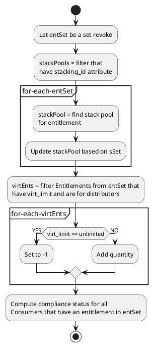

# PlantUML Activity diagrams

Examples, details, etc. for PlantUML Activity diagrams.


Embedded image here:

Example project showing how to use PlantUML and embed UML diagrams into a GitHub markdown

Often the need arises how to create and share UML diagrams for architecture documentation without pain-in-the-**** tools like MS Visio.

After some research, I found [this great post about PlantUML](https://blog.anoff.io/2018-07-31-diagrams-with-plantuml/). There are simply 2 components you need:

1. A PlantUML editor - simply use [http://www.plantuml.com/plantuml/uml/](http://www.plantuml.com/plantuml/uml/) (or host your own on-premise with the [plantUML Docker image](https://hub.docker.com/r/plantuml/plantuml-server/))
2. Integrate PlantUML render engine with GitHub `README.md` markdown

### 1. A PlantUML editor

Visit the online editor [http://www.plantuml.com/plantuml/uml/](http://www.plantuml.com/plantuml/uml/) and write your UML diagram with code & use a cheat sheet like this: https://ogom.github.io/draw_uml/plantuml/

This project contains an example [example-uml.iuml](example-uml.iuml):

```
@startuml
actor client
node app
node car
node tshirt

car -> app
app -> client
client -> tshirt
@enduml
```

There's also [an IntelliJ plugin for PlantUML](https://plugins.jetbrains.com/plugin/7017-plantuml-integration/).

### 2. Integrate PlantUML render engine with GitHub markdown

This part is simple, yet effective :) Simply use the PlantUML proxy `http://www.plantuml.com/plantuml/proxy` to render your `*.iuml` files and embed them like images:

```

``` 

Use the `RAW` version of your `*.iuml` files like that: [https://raw.githubusercontent.com/jonashackt/plantuml-markdown/master/example-uml.iuml](https://raw.githubusercontent.com/jonashackt/plantuml-markdown/master/example-uml.iuml) and prefix it with `src=`.

Also you should use the `cache=no` option so that GitHub always renders the currently committed version of your PlantUML `*.iuml` files.

That's all - simply see the diagram live:


[PlantUML](http://plantuml.com/) is a really awesome way to create diagrams by writing code instead of drawing and dragging visual elements. Markdown is a really nice documentation tool.

Here's how I combine the two, to create docs with embedded diagrams.

