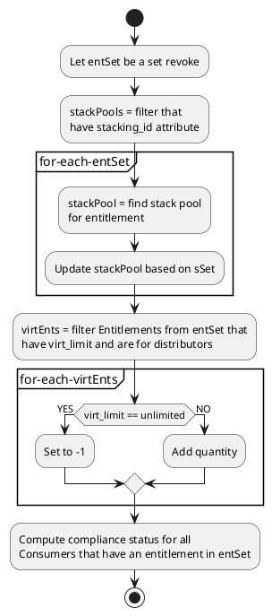

# PlantUML Activity diagrams

Examples, details, etc. for PlantUML Activity diagrams.

<svg xmlns="http://www.w3.org/2000/svg" xmlns:xlink="http://www.w3.org/1999/xlink" contentStyleType="text/css" height="920px" preserveAspectRatio="none" style="width:423px;height:920px;background:#FFFFFF;" version="1.1" viewBox="0 0 423 920" width="423px" zoomAndPan="magnify"><defs/><g><ellipse cx="167.6306" cy="20" fill="#222222" rx="10" ry="10" style="stroke:#222222;stroke-width:1.0;"/><rect fill="#F1F1F1" height="35.9609" rx="12.5" ry="12.5" style="stroke:#181818;stroke-width:0.5;" width="175.4023" x="79.9294" y="50"/><text fill="#000000" font-family="sans-serif" font-size="12" lengthAdjust="spacing" textLength="155.4023" x="89.9294" y="72.9492">ClickServlet.handleRequest()</text><rect fill="#F1F1F1" height="35.9609" rx="12.5" ry="12.5" style="stroke:#181818;stroke-width:0.5;" width="72.043" x="131.6091" y="105.9609"/><text fill="#000000" font-family="sans-serif" font-size="12" lengthAdjust="spacing" textLength="52.043" x="141.6091" y="128.9102">new page</text><rect fill="#F1F1F1" height="35.9609" rx="12.5" ry="12.5" style="stroke:#181818;stroke-width:0.5;" width="88.707" x="123.2771" y="211.2373"/><text fill="#000000" font-family="sans-serif" font-size="12" lengthAdjust="spacing" textLength="68.707" x="133.2771" y="234.1865">Page.onInit()</text><rect fill="#F1F1F1" height="35.9609" rx="12.5" ry="12.5" style="stroke:#181818;stroke-width:0.5;" width="108.6992" x="113.281" y="316.5137"/><text fill="#000000" font-family="sans-serif" font-size="12" lengthAdjust="spacing" textLength="88.6992" x="123.281" y="339.4629">Process controls</text><polygon fill="#F1F1F1" points="115.6519,372.4746,219.6094,372.4746,231.6094,384.4746,219.6094,396.4746,115.6519,396.4746,103.6519,384.4746,115.6519,372.4746" style="stroke:#181818;stroke-width:0.5;"/><text fill="#000000" font-family="sans-serif" font-size="11" lengthAdjust="spacing" textLength="103.9575" x="115.6519" y="389.0293">continue processing?</text><text fill="#000000" font-family="sans-serif" font-size="11" lengthAdjust="spacing" textLength="12.2354" x="231.6094" y="381.7139">no</text><ellipse cx="265.8447" cy="384.4746" fill="none" rx="11" ry="11" style="stroke:#222222;stroke-width:1.0;"/><ellipse cx="265.8447" cy="384.4746" fill="#222222" rx="6" ry="6" style="stroke:#222222;stroke-width:1.0;"/><polygon fill="#F1F1F1" points="149.5945,439.9941,185.6667,439.9941,197.6667,451.9941,185.6667,463.9941,149.5945,463.9941,137.5945,451.9941,149.5945,439.9941" style="stroke:#181818;stroke-width:0.5;"/><text fill="#000000" font-family="sans-serif" font-size="11" lengthAdjust="spacing" textLength="36.0723" x="149.5945" y="456.5488">isPost?</text><text fill="#000000" font-family="sans-serif" font-size="11" lengthAdjust="spacing" textLength="17.1177" x="120.4768" y="449.2334">yes</text><text fill="#000000" font-family="sans-serif" font-size="11" lengthAdjust="spacing" textLength="12.2354" x="197.6667" y="449.2334">no</text><rect fill="#F1F1F1" height="35.9609" rx="12.5" ry="12.5" style="stroke:#181818;stroke-width:0.5;" width="96.7109" x="62.0872" y="473.9941"/><text fill="#000000" font-family="sans-serif" font-size="12" lengthAdjust="spacing" textLength="76.7109" x="72.0872" y="496.9434">Page.onPost()</text><rect fill="#F1F1F1" height="35.9609" rx="12.5" ry="12.5" style="stroke:#181818;stroke-width:0.5;" width="92.041" x="178.7981" y="473.9941"/><text fill="#000000" font-family="sans-serif" font-size="12" lengthAdjust="spacing" textLength="72.041" x="188.7981" y="496.9434">Page.onGet()</text><polygon fill="#F1F1F1" points="167.6306,515.9551,179.6306,527.9551,167.6306,539.9551,155.6306,527.9551,167.6306,515.9551" style="stroke:#181818;stroke-width:0.5;"/><rect fill="#F1F1F1" height="35.9609" rx="12.5" ry="12.5" style="stroke:#181818;stroke-width:0.5;" width="112.0566" x="111.6023" y="559.9551"/><text fill="#000000" font-family="sans-serif" font-size="12" lengthAdjust="spacing" textLength="92.0566" x="121.6023" y="582.9043">Page.onRender()</text><polygon fill="#F1F1F1" points="140.4287,267.1982,194.8325,267.1982,206.8325,279.1982,194.8325,291.1982,140.4287,291.1982,128.4287,279.1982,140.4287,267.1982" style="stroke:#181818;stroke-width:0.5;"/><text fill="#000000" font-family="sans-serif" font-size="11" lengthAdjust="spacing" textLength="12.2354" x="171.6306" y="303.0684">no</text><text fill="#000000" font-family="sans-serif" font-size="11" lengthAdjust="spacing" textLength="54.4038" x="140.4287" y="283.7529">isForward?</text><polygon fill="#F1F1F1" points="167.6306,615.916,179.6306,627.916,167.6306,639.916,155.6306,627.916,167.6306,615.916" style="stroke:#181818;stroke-width:0.5;"/><polygon fill="#F1F1F1" points="111.6826,161.9219,223.5786,161.9219,235.5786,173.9219,223.5786,185.9219,111.6826,185.9219,99.6826,173.9219,111.6826,161.9219" style="stroke:#181818;stroke-width:0.5;"/><text fill="#000000" font-family="sans-serif" font-size="11" lengthAdjust="spacing" textLength="18.9546" x="171.6306" y="197.792">true</text><text fill="#000000" font-family="sans-serif" font-size="11" lengthAdjust="spacing" textLength="111.896" x="111.6826" y="178.4766">Page.onSecurityCheck</text><text fill="#000000" font-family="sans-serif" font-size="11" lengthAdjust="spacing" textLength="23.2354" x="235.5786" y="171.1611">false</text><polygon fill="#F1F1F1" points="167.6306,659.916,179.6306,671.916,167.6306,683.916,155.6306,671.916,167.6306,659.916" style="stroke:#181818;stroke-width:0.5;"/><polygon fill="#F1F1F1" points="138.5864,703.916,196.6748,703.916,208.6748,715.916,196.6748,727.916,138.5864,727.916,126.5864,715.916,138.5864,703.916" style="stroke:#181818;stroke-width:0.5;"/><text fill="#000000" font-family="sans-serif" font-size="11" lengthAdjust="spacing" textLength="58.0884" x="138.5864" y="720.4707">do redirect?</text><text fill="#000000" font-family="sans-serif" font-size="11" lengthAdjust="spacing" textLength="17.1177" x="109.4688" y="713.1553">yes</text><rect fill="#F1F1F1" height="35.9609" rx="12.5" ry="12.5" style="stroke:#181818;stroke-width:0.5;" width="105.3652" x="11" y="737.916"/><text fill="#000000" font-family="sans-serif" font-size="12" lengthAdjust="spacing" textLength="85.3652" x="21" y="760.8652">redirect process</text><polygon fill="#F1F1F1" points="242.5344,737.916,300.6228,737.916,312.6228,749.916,300.6228,761.916,242.5344,761.916,230.5344,749.916,242.5344,737.916" style="stroke:#181818;stroke-width:0.5;"/><text fill="#000000" font-family="sans-serif" font-size="11" lengthAdjust="spacing" textLength="58.0884" x="242.5344" y="754.4707">do forward?</text><text fill="#000000" font-family="sans-serif" font-size="11" lengthAdjust="spacing" textLength="17.1177" x="213.4167" y="747.1553">yes</text><text fill="#000000" font-family="sans-serif" font-size="11" lengthAdjust="spacing" textLength="12.2354" x="312.6228" y="747.1553">no</text><rect fill="#F1F1F1" height="35.9609" rx="12.5" ry="12.5" style="stroke:#181818;stroke-width:0.5;" width="107.3691" x="146.3652" y="771.916"/><text fill="#000000" font-family="sans-serif" font-size="12" lengthAdjust="spacing" textLength="87.3691" x="156.3652" y="794.8652">Forward request</text><rect fill="#F1F1F1" height="35.9609" rx="12.5" ry="12.5" style="stroke:#181818;stroke-width:0.5;" width="138.7461" x="273.7344" y="771.916"/><text fill="#000000" font-family="sans-serif" font-size="12" lengthAdjust="spacing" textLength="118.7461" x="283.7344" y="794.8652">Render page template</text><polygon fill="#F1F1F1" points="271.5786,813.877,283.5786,825.877,271.5786,837.877,259.5786,825.877,271.5786,813.877" style="stroke:#181818;stroke-width:0.5;"/><polygon fill="#F1F1F1" points="167.6306,843.877,179.6306,855.877,167.6306,867.877,155.6306,855.877,167.6306,843.877" style="stroke:#181818;stroke-width:0.5;"/><ellipse cx="167.6306" cy="898.877" fill="none" rx="11" ry="11" style="stroke:#222222;stroke-width:1.0;"/><ellipse cx="167.6306" cy="898.877" fill="#222222" rx="6" ry="6" style="stroke:#222222;stroke-width:1.0;"/><line style="stroke:#181818;stroke-width:1.0;" x1="167.6306" x2="167.6306" y1="30" y2="50"/><polygon fill="#181818" points="163.6306,40,167.6306,50,171.6306,40,167.6306,44" style="stroke:#181818;stroke-width:1.0;"/><line style="stroke:#181818;stroke-width:1.0;" x1="167.6306" x2="167.6306" y1="85.9609" y2="105.9609"/><polygon fill="#181818" points="163.6306,95.9609,167.6306,105.9609,171.6306,95.9609,167.6306,99.9609" style="stroke:#181818;stroke-width:1.0;"/><line style="stroke:#181818;stroke-width:1.0;" x1="167.6306" x2="167.6306" y1="396.4746" y2="439.9941"/><polygon fill="#181818" points="163.6306,429.9941,167.6306,439.9941,171.6306,429.9941,167.6306,433.9941" style="stroke:#181818;stroke-width:1.0;"/><line style="stroke:#181818;stroke-width:1.0;" x1="231.6094" x2="254.8447" y1="384.4746" y2="384.4746"/><polygon fill="#181818" points="244.8447,380.4746,254.8447,384.4746,244.8447,388.4746,248.8447,384.4746" style="stroke:#181818;stroke-width:1.0;"/><line style="stroke:#181818;stroke-width:1.0;" x1="167.6306" x2="167.6306" y1="352.4746" y2="372.4746"/><polygon fill="#181818" points="163.6306,362.4746,167.6306,372.4746,171.6306,362.4746,167.6306,366.4746" style="stroke:#181818;stroke-width:1.0;"/><line style="stroke:#181818;stroke-width:1.0;" x1="137.5945" x2="110.4426" y1="451.9941" y2="451.9941"/><line style="stroke:#181818;stroke-width:1.0;" x1="110.4426" x2="110.4426" y1="451.9941" y2="473.9941"/><polygon fill="#181818" points="106.4426,463.9941,110.4426,473.9941,114.4426,463.9941,110.4426,467.9941" style="stroke:#181818;stroke-width:1.0;"/><line style="stroke:#181818;stroke-width:1.0;" x1="197.6667" x2="224.8186" y1="451.9941" y2="451.9941"/><line style="stroke:#181818;stroke-width:1.0;" x1="224.8186" x2="224.8186" y1="451.9941" y2="473.9941"/><polygon fill="#181818" points="220.8186,463.9941,224.8186,473.9941,228.8186,463.9941,224.8186,467.9941" style="stroke:#181818;stroke-width:1.0;"/><line style="stroke:#181818;stroke-width:1.0;" x1="110.4426" x2="110.4426" y1="509.9551" y2="527.9551"/><line style="stroke:#181818;stroke-width:1.0;" x1="110.4426" x2="155.6306" y1="527.9551" y2="527.9551"/><polygon fill="#181818" points="145.6306,523.9551,155.6306,527.9551,145.6306,531.9551,149.6306,527.9551" style="stroke:#181818;stroke-width:1.0;"/><line style="stroke:#181818;stroke-width:1.0;" x1="224.8186" x2="224.8186" y1="509.9551" y2="527.9551"/><line style="stroke:#181818;stroke-width:1.0;" x1="224.8186" x2="179.6306" y1="527.9551" y2="527.9551"/><polygon fill="#181818" points="189.6306,523.9551,179.6306,527.9551,189.6306,531.9551,185.6306,527.9551" style="stroke:#181818;stroke-width:1.0;"/><line style="stroke:#181818;stroke-width:1.0;" x1="167.6306" x2="167.6306" y1="539.9551" y2="559.9551"/><polygon fill="#181818" points="163.6306,549.9551,167.6306,559.9551,171.6306,549.9551,167.6306,553.9551" style="stroke:#181818;stroke-width:1.0;"/><line style="stroke:#181818;stroke-width:1.0;" x1="167.6306" x2="167.6306" y1="291.1982" y2="316.5137"/><polygon fill="#181818" points="163.6306,306.5137,167.6306,316.5137,171.6306,306.5137,167.6306,310.5137" style="stroke:#181818;stroke-width:1.0;"/><line style="stroke:#181818;stroke-width:1.0;" x1="206.8325" x2="298.8447" y1="279.1982" y2="279.1982"/><polygon fill="#181818" points="294.8447,426.4746,298.8447,436.4746,302.8447,426.4746,298.8447,430.4746" style="stroke:#181818;stroke-width:1.0;"/><line style="stroke:#181818;stroke-width:1.0;" x1="298.8447" x2="298.8447" y1="279.1982" y2="627.916"/><line style="stroke:#181818;stroke-width:1.0;" x1="298.8447" x2="179.6306" y1="627.916" y2="627.916"/><polygon fill="#181818" points="189.6306,623.916,179.6306,627.916,189.6306,631.916,185.6306,627.916" style="stroke:#181818;stroke-width:1.0;"/><line style="stroke:#181818;stroke-width:1.0;" x1="167.6306" x2="167.6306" y1="595.916" y2="615.916"/><polygon fill="#181818" points="163.6306,605.916,167.6306,615.916,171.6306,605.916,167.6306,609.916" style="stroke:#181818;stroke-width:1.0;"/><line style="stroke:#181818;stroke-width:1.0;" x1="167.6306" x2="167.6306" y1="247.1982" y2="267.1982"/><polygon fill="#181818" points="163.6306,257.1982,167.6306,267.1982,171.6306,257.1982,167.6306,261.1982" style="stroke:#181818;stroke-width:1.0;"/><line style="stroke:#181818;stroke-width:1.0;" x1="167.6306" x2="167.6306" y1="185.9219" y2="211.2373"/><polygon fill="#181818" points="163.6306,201.2373,167.6306,211.2373,171.6306,201.2373,167.6306,205.2373" style="stroke:#181818;stroke-width:1.0;"/><line style="stroke:#181818;stroke-width:1.0;" x1="235.5786" x2="320.8447" y1="173.9219" y2="173.9219"/><polygon fill="#181818" points="316.8447,406.4746,320.8447,416.4746,324.8447,406.4746,320.8447,410.4746" style="stroke:#181818;stroke-width:1.0;"/><line style="stroke:#181818;stroke-width:1.0;" x1="320.8447" x2="320.8447" y1="173.9219" y2="671.916"/><line style="stroke:#181818;stroke-width:1.0;" x1="320.8447" x2="179.6306" y1="671.916" y2="671.916"/><polygon fill="#181818" points="189.6306,667.916,179.6306,671.916,189.6306,675.916,185.6306,671.916" style="stroke:#181818;stroke-width:1.0;"/><line style="stroke:#181818;stroke-width:1.0;" x1="167.6306" x2="167.6306" y1="639.916" y2="659.916"/><polygon fill="#181818" points="163.6306,649.916,167.6306,659.916,171.6306,649.916,167.6306,653.916" style="stroke:#181818;stroke-width:1.0;"/><line style="stroke:#181818;stroke-width:1.0;" x1="167.6306" x2="167.6306" y1="141.9219" y2="161.9219"/><polygon fill="#181818" points="163.6306,151.9219,167.6306,161.9219,171.6306,151.9219,167.6306,155.9219" style="stroke:#181818;stroke-width:1.0;"/><line style="stroke:#181818;stroke-width:1.0;" x1="230.5344" x2="200.0498" y1="749.916" y2="749.916"/><line style="stroke:#181818;stroke-width:1.0;" x1="200.0498" x2="200.0498" y1="749.916" y2="771.916"/><polygon fill="#181818" points="196.0498,761.916,200.0498,771.916,204.0498,761.916,200.0498,765.916" style="stroke:#181818;stroke-width:1.0;"/><line style="stroke:#181818;stroke-width:1.0;" x1="312.6228" x2="343.1074" y1="749.916" y2="749.916"/><line style="stroke:#181818;stroke-width:1.0;" x1="343.1074" x2="343.1074" y1="749.916" y2="771.916"/><polygon fill="#181818" points="339.1074,761.916,343.1074,771.916,347.1074,761.916,343.1074,765.916" style="stroke:#181818;stroke-width:1.0;"/><line style="stroke:#181818;stroke-width:1.0;" x1="200.0498" x2="200.0498" y1="807.877" y2="825.877"/><line style="stroke:#181818;stroke-width:1.0;" x1="200.0498" x2="259.5786" y1="825.877" y2="825.877"/><polygon fill="#181818" points="249.5786,821.877,259.5786,825.877,249.5786,829.877,253.5786,825.877" style="stroke:#181818;stroke-width:1.0;"/><line style="stroke:#181818;stroke-width:1.0;" x1="343.1074" x2="343.1074" y1="807.877" y2="825.877"/><line style="stroke:#181818;stroke-width:1.0;" x1="343.1074" x2="283.5786" y1="825.877" y2="825.877"/><polygon fill="#181818" points="293.5786,821.877,283.5786,825.877,293.5786,829.877,289.5786,825.877" style="stroke:#181818;stroke-width:1.0;"/><line style="stroke:#181818;stroke-width:1.0;" x1="126.5864" x2="63.6826" y1="715.916" y2="715.916"/><line style="stroke:#181818;stroke-width:1.0;" x1="63.6826" x2="63.6826" y1="715.916" y2="737.916"/><polygon fill="#181818" points="59.6826,727.916,63.6826,737.916,67.6826,727.916,63.6826,731.916" style="stroke:#181818;stroke-width:1.0;"/><line style="stroke:#181818;stroke-width:1.0;" x1="208.6748" x2="271.5786" y1="715.916" y2="715.916"/><line style="stroke:#181818;stroke-width:1.0;" x1="271.5786" x2="271.5786" y1="715.916" y2="737.916"/><polygon fill="#181818" points="267.5786,727.916,271.5786,737.916,275.5786,727.916,271.5786,731.916" style="stroke:#181818;stroke-width:1.0;"/><line style="stroke:#181818;stroke-width:1.0;" x1="63.6826" x2="63.6826" y1="773.877" y2="855.877"/><line style="stroke:#181818;stroke-width:1.0;" x1="63.6826" x2="155.6306" y1="855.877" y2="855.877"/><polygon fill="#181818" points="145.6306,851.877,155.6306,855.877,145.6306,859.877,149.6306,855.877" style="stroke:#181818;stroke-width:1.0;"/><line style="stroke:#181818;stroke-width:1.0;" x1="271.5786" x2="271.5786" y1="837.877" y2="855.877"/><line style="stroke:#181818;stroke-width:1.0;" x1="271.5786" x2="179.6306" y1="855.877" y2="855.877"/><polygon fill="#181818" points="189.6306,851.877,179.6306,855.877,189.6306,859.877,185.6306,855.877" style="stroke:#181818;stroke-width:1.0;"/><line style="stroke:#181818;stroke-width:1.0;" x1="167.6306" x2="167.6306" y1="683.916" y2="703.916"/><polygon fill="#181818" points="163.6306,693.916,167.6306,703.916,171.6306,693.916,167.6306,697.916" style="stroke:#181818;stroke-width:1.0;"/><line style="stroke:#181818;stroke-width:1.0;" x1="167.6306" x2="167.6306" y1="867.877" y2="887.877"/><polygon fill="#181818" points="163.6306,877.877,167.6306,887.877,171.6306,877.877,167.6306,881.877" style="stroke:#181818;stroke-width:1.0;"/><!--SRC=[PLAzReCm4Dxz5BSLXi1kXWwHMdMBaYTmpG5MZ4ti8r7Ullu1Ifl9f_j-zDsTtmQYoVEwdhGmD8-wadQiXIHrL_Gyj4hqJeo7RoJ1c2VXYF6ZLl9wGNVNIDKWJAlnZBSPFHLbmxZ11qoYnuQf3efJg2fhBYXd5noF0yfh2JIWWOBSZ2K3u0lfowXa0H2LodzOzn2kVL_vnaPsv3ihqNkGrf2psZUf7KMneyoCC6MAClsB7C2JdLA9fbKTszJAdwodJV14lohMY17F4ODOUzoxhfnF_AKa_pru3Yrq6Szejkb4U4gs18fXMWiEM-LGlYJYAx2EsIINPN51sFtRt3O9NtOQhDF5Kem_S_2SC9qG2CVmCGXtQNF0jC4V]--></g></svg>
