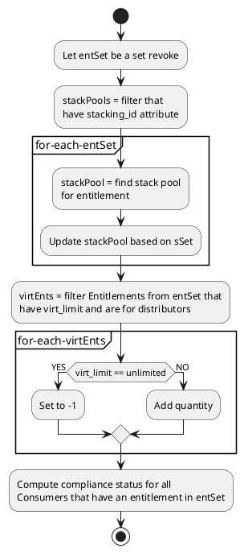

# PlantUML Activity diagrams

Examples, details, etc. for PlantUML Activity diagrams.

```plantuml
@startuml
start
:Let entSet be a set revoke;
:stackPools = filter that
have stacking_id attribute;
partition for-each-entSet {
:stackPool = find stack pool  
for entitlement;
:Update stackPool based on sSet;
}
:virtEnts = filter Entitlements from entSet that 
have virt_limit and are for distributors;
partition for-each-virtEnts {
if (virt_limit == unlimited) then
-> YES;
:Set to -1;
else
-> NO;
:Add quantity;
endif
}
:Compute compliance status for all 
Consumers that have an entitlement in entSet;
stop
@enduml
```
