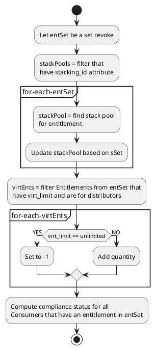

# PlantUML Activity diagrams

Examples, details, etc. for PlantUML Activity diagrams.


Embedded image here:

Example project showing how to use PlantUML and embed UML diagrams into a GitHub markdown

Often the need arises how to create and share UML diagrams for architecture documentation without pain-in-the-**** tools like MS Visio.

After some research, I found [this great post about PlantUML](https://blog.anoff.io/2018-07-31-diagrams-with-plantuml/). There are simply 2 components you need:

1. A PlantUML editor - simply use [http://www.plantuml.com/plantuml/uml/](http://www.plantuml.com/plantuml/uml/) (or host your own on-premise with the [plantUML Docker image](https://hub.docker.com/r/plantuml/plantuml-server/))
2. Integrate PlantUML render engine with GitHub `README.md` markdown

### 1. A PlantUML editor

Visit the online editor [http://www.plantuml.com/plantuml/uml/](http://www.plantuml.com/plantuml/uml/) and write your UML diagram with code & use a cheat sheet like this: https://ogom.github.io/draw_uml/plantuml/

This project contains an example [example-uml.iuml](example-uml.iuml):

```
@startuml
actor client
node app
node car
node tshirt

car -> app
app -> client
client -> tshirt
@enduml
```

There's also [an IntelliJ plugin for PlantUML](https://plugins.jetbrains.com/plugin/7017-plantuml-integration/).

### 2. Integrate PlantUML render engine with GitHub markdown

This part is simple, yet effective :) Simply use the PlantUML proxy `http://www.plantuml.com/plantuml/proxy` to render your `*.iuml` files and embed them like images:

```

``` 

Use the `RAW` version of your `*.iuml` files like that: [https://raw.githubusercontent.com/jonashackt/plantuml-markdown/master/example-uml.iuml](https://raw.githubusercontent.com/jonashackt/plantuml-markdown/master/example-uml.iuml) and prefix it with `src=`.

Also you should use the `cache=no` option so that GitHub always renders the currently committed version of your PlantUML `*.iuml` files.

That's all - simply see the diagram live:


[PlantUML](http://plantuml.com/) is a really awesome way to create diagrams by writing code instead of drawing and dragging visual elements. Markdown is a really nice documentation tool.

Here's how I combine the two, to create docs with embedded diagrams.

## Step 0: Setup

Get the command-line PlantUML from [the download page](http://plantuml.com/download) or your relevant package manager.

## Step 1: Create a Markdown file

Use your favorite markdown or text editor. Most (if not all) developer-oriented text editors have some kind of markdown support.

Remember that md files can contain html, and that html is passed-through to the generated html as-is.

When you want to embed a diagram, create a hidden div: `<div hidden>`.

Now start a code block by indenting or typing 3 backticks. The first line of the code block must be `@startuml` followed by a file name (with no extension). The following lines should be the actual diagram code, ending with `@enduml`. End the code block and close the div.

Finally, to actually show the diagram in the document, add an image in markdown:
``````. The name must be the same name as in the `@startuml` command, with a `.svg` extension.

### All together now
	
	Regular **Markdown** here.
	
	<div hidden>
	```
	@startuml firstDiagram
	
	Alice -> Bob: Hello
	Bob -> Alice: Hi!
			
	@enduml
	```
	</div>
	
	
	
	Some more markdown.
	
## Step 2: Run PlantUML on the Markdown file

On the command line:

	plantuml -tsvg FILENAME

Where FILENAME is the name of the markdown file.

For every PlantUML block in the file, one svg diagram is generated. When the markdown to html converter is running, the html will contain image links to the generated images.

## Step 3: Convert locally to HTML or upload to GitHub

If you host the files in GitHub (or other services that convert md to html on the fly), the last step is uploading or pushing the files. Make sure to include everything: the markdown and the generated diagrams.

Otherwise, use your favorite tool for converting markdown to html - a markdown editor or a command line tool.
