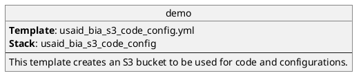

```plantuml
@startuml
' RDS Main template Resources
Resources:
  rdslabsVPCStack:
    Type: AWS::CloudFormation::Stack
    Properties:
      TemplateURL: https://pg-rds-lab-cloudformation.s3.amazonaws.com/nested/rds-pg-labs-vpc.yml
      Parameters:
        TemplateName: !Ref TemplateName
  rdslabsC9Stack:
    Type: AWS::CloudFormation::Stack
    Properties:
      TemplateURL: https://pg-rds-lab-cloudformation.s3.amazonaws.com/nested/rds-pg-labs-bastion-c9.yml
      Parameters:
          PubSubnetId: !GetAtt 'rdslabsVPCStack.Outputs.PublicSubnetA'
          TemplateName: !Ref TemplateName
          EnvType: !Ref EnvType
  rdslabsRDSStack:
    Type: AWS::CloudFormation::Stack
    Properties:
      TemplateURL: https://pg-rds-lab-cloudformation.s3.amazonaws.com/nested/rds-pg-labs-rds.yml
      Parameters:
          TemplateName: !Ref TemplateName
          CreateInstance: !Ref CreateInstance
          DBMasterUserPassword: 'Masteruser123!'
          MainVPC: !GetAtt rdslabsVPCStack.Outputs.MainVPC
          PrivateSubnets: !GetAtt 'rdslabsVPCStack.Outputs.PrivateSubnets'

@enduml
```

# usaid-ghsc-bia

Items contained in this document inlcude details:
* AWS Resources: Details, settings/configurations, etc. for individual AWS Resources
* Pipeline/Deployment Process - Details regarding the planned development/deployment processes, including CI/CD.
* Other?


For each resource the following information will be identified:
- Source of resource definition (which template/stack/etc)
- Purpose of the Resource - Description
- Dependencies (Resources, etc)
- Depended on by - What resources use/need this resource # usaid-ghsc-bia

Items contained in this document inlcude details:
* AWS Resources: Details, settings/configurations, etc. for individual AWS Resources
* Pipeline/Deployment Process - Details regarding the planned development/deployment processes, including CI/CD.
* Other?


For each resource the following information will be identified:
- Source of resource definition (which template/stack/etc)
- Purpose of the Resource - Description
- Dependencies (Resources, etc)
- Depended on by - What resources use/need this resource
- What parameters need to be provided.


Unit test senario:
- S3 inbound bucket including Trigger event
- SNS topic for inbound trigger event
- State machine or step function
- Target S3 bucket (Data lake)
- Lambda functions
  - unzip/uncompress
  - move file


## Environments

Describe environments (dev, test, uat, etc.).
> **_TODO:_**  Vamsi to provide details on the various environements.


## CloudFormation Templates

The following CloudFormation templates are used for the intial setup and deployment of the AWS resources required for managing the USAID BIA Data Lake and Data Marts.


### Global Definitions

Defined in datalake cloudformation template.

This below help function is used on all templates.

```yaml
Function:
    Runtime: python3.7
    Handler: lambda_function.lambda_handler
    Tracing: "Active"
    Environment:
      Variables:
        REGION: !Ref AWS::Region
        ATHENABUCKET: !ImportValue s3-athena-query-results
        DATALAKEMARTBUCKET: !ImportValue s3-data-lake-and-marts
    Timeout: 60
    MemorySize: 1024
    Layers:
      - !ImportValue layer-helper
```

### [s3-code-config.cft](foundation/s3-code-config.cft) - S3 Code Config CloudFormation template

Create S3 bucket for maintaining code configurations, etc.  The bucket name uses the AWS Account ID as part of the name to ensure bucket name uniqueness.


#### S3 Code Config template - Parameters

| Parameter              | Default                  | Description                                                    |
|:-----------------------|:-------------------------|:---------------------------------------------------------------|
| EnvType                | dev                      | Determines if we are in EE or not                              |
| Environment            | dev                      | Environment name                                               |
| LogLevel               | DEBUG                    | Level of Logging                                               |
| ProjectName            | usaid-ghsc-bia           | Name of Project                                                |
| S3CodeConfigBucketName | s3-usaid-bia-code-config | Name of S3 Bucket that stores/manages code and configurations. |
| TemplateName           | rds-pg-labs              | Name used for different elements created.                      |

#### S3 Code Config template - Created Resources

Resources created by this template.

[S3 Bucket - Code Configurations](#code-configuration-bucket-s3-bucket)


### [foundation.yaml](foundation.yaml) - Foundation CloudFormation template

#### foundation template - Parameters

| Parameter              | Default                  | Description                                                    |
|:-----------------------|:-------------------------|:---------------------------------------------------------------|
| EnvType                | dev                      | Determines if we are in EE or not                              |
| Environment            | dev                      | Environment name                                               |
| LogLevel               | DEBUG                    | Level of Logging                                               |
| ProjectName            | usaid-ghsc-bia           | Name of Project                                                |
| S3CodeConfigBucketName | s3-usaid-bia-code-config | Name of S3 Bucket that stores/manages code and configurations. |
| TemplateName           | rds-pg-labs              | Name used for different elements created.                      |

#### foundation template - Created Resources

Resources created by this template.

Link to resource details below.

### [datalake.yaml](datalake.yaml) - Data Lake CloudFormation template

#### datalake template - Parameters

No Parameters

#### dtatalake template - Created Resources

Resources created by this template.

Link to resource details below.

### [datamart.yaml](datamart.yaml) - Data Mart CloudFormation template

#### datamart template - Parameters

No Parameters

#### dtatamart template - Created Resources

Resources created by this template.

Link to resource details below.

## Build Scripts/Settings


The [setup.sh](setup.sh) script sets the various script variables used in other scripts.

<details>
<summary>Summary - Collapsed Section with Code Block</summary>
<p>

```c#
public class Order
{
    public int OrderId { get; set; }
    public int CustomerId { get; set; }
 
    public List<int> Products { get; set; }
}
```

</details>


```bash
#!/usr/bin/env bash
# shellcheck disable=SC2034

export AWS_PROFILE="dave-personal"

# set AWS Account ID
aws_account_id=$(aws sts get-caller-identity --query 'Account' --output text --profile ${AWS_PROFILE})

deployment_region="us-east-1"

# Settings for S3 Bucket to manage CloudFormation, etc. resources.
s3_config_stack_name="usaid-bia-s3-code-config-djh"
s3_code_config_template_file="s3-code-config.cft"
# TODO: The S3 bucket name is set in the cft file...if this is ever needed it should be retrieved from the cfn output.
s3_code_config_bucket_name="usaid-ghsc-bia-s3-code-config-dev-${aws_account_id}"
s3_code_prefix="usaid-bia"

# Foundation stack details
foundation_stack_name="usaid-bia-foundation"
foundation_template_file="foundation.yaml"
foundation_output_template_file="foundation_packaged.yaml"

ingestion_cfn_output_template_file="ingestion_packaged-template.yaml"

ingestion_stack_name="ingest-ghsc-psm-artmis"


date_time=$(date +'%Y_%m_%d_%H_%M_%S')
log_dir="logs"
```

The [deploy_foundation_stacks.sh](deploy_foundation_stacks.sh) script ise used to create the CloudFormation stacks for the foundational resoureces.
The following variables are defined/used in the script.

```bash
#!/usr/bin/env bash

source setup.sh
log_file="logs/deploy-foundation-stacks-${DATE_TIME}.log"

sam deploy\
  --template-file ${foundation_template_file}\
  --s3-bucket ${s3_code_config_bucket_name}\
  --capabilities CAPABILITY_NAMED_IAM\
  --stack-name ${foundation_stack_name}\
  --region ${deployment_region}\
  --confirm-changeset | tee -a ${log_file}
```






## Global Settings/Variables

REGION: !Ref "AWS::Region"
ATHENABUCKET: !Ref AthenaQueryResultsBucket
DATALAKEMARTBUCKET: !Ref DataLakeAndMarts

## S3 Buckets

### Code Configuration Bucket - S3 Bucket

Resource Name:
Definition Source: [s3-code-config.cft](foundation/s3-code-config.cft)

The template [s3-code-config.cft](foundation/s3-code-config.cft) creates an S3 bucket to be used by CloudFormation jobs, etc.

|Resource              |Description             |Dependencies                                                  |Used by|
|:---------------------|:-----------------------|:-------------------------------------------------------------|:------|
|s3 Code Config Bucket |dev                     |Determines if we are in EE or not                             |       |
|Environment           |dev                     |Environment name                                              |       |
|LogLevel              |DEBUG                   |Level of Logging                                              |       |
|ProjectName           |usaid-ghsc-bia          |Name of Project                                               |       |
|S3CodeConfigBucketName|s3-usaid-bia-code-config|Name of S3 Bucket that stores/manages code and configurations.|       |
|TemplateName          |rds-pg-labs             |Name used for different elements created.                     |       |


### Data Provider/Inbound Bucket - S3 Bucket

Raw data being received from data providers

Name: <Region (e1)>-<Environment (devtest)>-ghsc-dataprovider
Events: s3 Object Created Event - Calls [FilePostingBroker](#file-posting-broker---serverless-function)

```yaml
DataProvider:
    Type: AWS::S3::Bucket
    Properties:
      BucketName: !Sub "usaid-ghsc-bia-dataprovider-${AWS::AccountId}-us-east-1"
      BucketEncryption:
        ServerSideEncryptionConfiguration:
          -
            ServerSideEncryptionByDefault:
              SSEAlgorithm: AES256
      LifecycleConfiguration:
        Rules:
          - Status: Enabled
            ExpirationInDays: 60
      NotificationConfiguration:
        LambdaConfigurations:
          - Event:  s3:ObjectCreated:*
            Function: !GetAtt FilePostingBrokerFunction.Arn
```

### Athena Query Results Bucket - S3 Bucket

Name: <Region (e1)>-<Environment (devtest)>-ghsc-athena-query-results

usaid-ghsc-bia-athena-query-results-${AWS::AccountId}-us-east-1

```yaml
 AthenaQueryResultsBucket:
    Type: AWS::S3::Bucket
    Properties:
      BucketName: !Sub "usaid-ghsc-bia-athena-query-results-${AWS::AccountId}-us-east-1"
      BucketEncryption:
        ServerSideEncryptionConfiguration:
          -
            ServerSideEncryptionByDefault:
              SSEAlgorithm: AES256
      LifecycleConfiguration:
        Rules:
          - Status: Enabled
            ExpirationInDays: 60
```

### Data Lake and Marts Bucket - S3 Bucket

Data Lake and Data Mart S3 bucket.

NOTE: This bucket is partitioned for both data lake and data mart objects.

Name: <Region (e1)>-<Environment (devtest)>-ghsc-datamart

Different lifecycle runs for data lake and data mart

```yaml
DataLakeAndMarts:
    Type: AWS::S3::Bucket
    Properties:
      BucketName: !Sub "usaid-ghsc-bia-datamart-${AWS::AccountId}-us-east-1"
      BucketEncryption:
        ServerSideEncryptionConfiguration:
          -
            ServerSideEncryptionByDefault:
              SSEAlgorithm: AES256
      VersioningConfiguration:
        Status: Enabled
      LifecycleConfiguration:
        Rules:
          - Status: Enabled
            Prefix: "datamart"
            NoncurrentVersionExpirationInDays: 60
            NoncurrentVersionTransitions:
              - StorageClass: GLACIER
                TransitionInDays: 1
          - Status: Enabled
            Prefix: "datalake"
            NoncurrentVersionExpirationInDays: 60
            NoncurrentVersionTransitions:
              - StorageClass: GLACIER
                TransitionInDays: 1
```

## Lambda

### Helper Layer - LayerVersion

- copy_object - Copies objects between 2 S3 buckets
- DecimalEncoder - Class for dealing with decimal
- get_athena_query_results - Athena query results
- get_athena_query_results_json - Athena query results in JSON format
- get_named_query_details - Get named query results
- get_size - Bucket size
- is_next_week - Function
- is_this_week -
- monthdelta -

### file-posting-broker - Serverless Function

file ingest step 1 - subscribes to the file-postings sns topic and fans out messages to downstream sns topics

```yaml
FilePostingBrokerFunction:
    Type:  AWS::Serverless::Function
    Properties:
      FunctionName: "file-posting-broker"
      Description: "file ingest step 1 - subscribes to the file-postings sns topic and fans out messages to downstream sns topics"
      CodeUri: ./foundation/file-posting-broker
      Role: !GetAtt LambdaExecRole.Arn
      Environment:
        Variables:
          STEPS_INBOX_PROCESSING: !Ref StepsInboxProcessing
          SNS_UNCOMPRESS_UNTAR: !Ref UtilUncompressUntarTopic
```

#### LambdaInvokePermissions - Permission

Name: LambdaInvokePermission
Where Used: file posting broker function

```yaml
LambdaInvokePermission:
    Type: AWS::Lambda::Permission
    Properties:
      FunctionName: !GetAtt FilePostingBrokerFunction.Arn
      Action: lambda:InvokeFunction
      Principal: s3.amazonaws.com
      SourceAccount: !Ref AWS::AccountId
      SourceArn: !Sub "arn:aws:s3:::usaid-ghsc-bia-dataprovider-${AWS::AccountId}-us-east-1"
```

### Uncompress and Untar utility - Serverless Function

Function used in State Machine - inbox-processing
Name: util-uncompress-untar-s3-in-place

```yaml
UtilUncompressUntarFunction:
    Type:  AWS::Serverless::Function
    Properties:
      FunctionName: util-uncompress-untar-s3-in-place
      Description: uncompress and untar a file in place
      CodeUri: ./foundation/util-uncompress-untar-s3-in-place
      Role: !GetAtt LambdaExecRole.Arn
```

#### Util Uncompress Function - LambdaPermissions

```yaml
UtilUncompressUntarTopicInvokePermission:
    Type: AWS::Lambda::Permission
    Properties:
      Action: lambda:InvokeFunction
      Principal: sns.amazonaws.com
      SourceArn: !Ref UtilUncompressUntarTopic
      FunctionName:
        !GetAtt UtilUncompressUntarFunction.Arn
```

### Move File to Data Lake - Serverless Function

Function used in State Machine to move object to the data lake S3 buckets
Name: move-file-to-data-lake

```yaml
MoveFileToDataLakeFunction:
    Type:  AWS::Serverless::Function
    Properties:
      FunctionName: move-file-to-data-lake
      Description: file ingest - move to data lake location
      CodeUri: ./foundation/move-file-to-data-lake
      Role: !GetAtt LambdaExecRole.Arn
```

#### Util Uncompress Function - LambdaPermissions

```yaml
UtilUncompressUntarTopicInvokePermission:
    Type: AWS::Lambda::Permission
    Properties:
      Action: lambda:InvokeFunction
      Principal: sns.amazonaws.com
      SourceArn: !Ref UtilUncompressUntarTopic
      FunctionName:
        !GetAtt UtilUncompressUntarFunction.Arn
```

### Data Mart run named query function - Lambda Function

Runs named queries
Name: datamart-run-named-query

```yaml
DatamartRunNamedQueryFunction:
    Type:  AWS::Serverless::Function
    Properties:
      FunctionName: datamart-run-named-query
      Description: run named queries for datamart
      CodeUri: ./datamart/datamart-run-named-query
      Role: !ImportValue iam-lambda-exec-role-arn
```

## SNS Topics

### ops-notification - SNS Topic

Name: ops-notification - Standard SNS topic

```yaml
OpsNotificationsTopic:
    Type: AWS::SNS::Topic
    Properties:
      TopicName: ops-notifications
```

### util-uncompress-untar - SNS Topic

SNS Topic posted to when untar/uncompress complete
Name: util-uncompress-untar - Standard SNS topic
Where Used: Call in [util-uncompress-untar-s3-in-place](#uncompress-and-untar-utility---serverless-function)

```yaml
UtilUncompressUntarTopic:
    Type: AWS::SNS::Topic
    Properties:
      TopicName: "util-uncompress-untar"
      Subscription:
        -
          Protocol: "lambda"
          Endpoint:
            !GetAtt UtilUncompressUntarFunction.Arn
```

#### Utility Uncompress/Untar SNS Topic Policy

Policy for SNS topic and Lambda to allow the uncompress/untar function to post to the SNS topic

```yaml
UtilUncompressUntarTopicPolicy:
    Type: AWS::SNS::TopicPolicy
    Properties:
      Topics:
        - !Ref UtilUncompressUntarTopic
      PolicyDocument:
        Id: UtilUncompressUntarTopicPolicy
        Version: '2012-10-17'
        Statement:
          - Sid: AllowLambdaToPublish
            Effect: Allow
            Action: sns:Publish
            Resource: !Ref UtilUncompressUntarTopic
            Principal:
              AWS: !GetAtt LambdaExecRole.Arn
```

## Roles

### bia-<AWS Account ID>-lambda-exec

Where used: TBD

```yaml
LambdaExecRole:
    Type: AWS::IAM::Role
    Properties:
      AssumeRolePolicyDocument:
        Version: '2012-10-17'
        Statement:
        - Action:
          - sts:AssumeRole
          Principal:
            Service:
            - lambda.amazonaws.com
          Effect: Allow
      ManagedPolicyArns:
      - arn:aws:iam::aws:policy/AWSLambda_FullAccess
      - arn:aws:iam::aws:policy/AmazonSNSFullAccess
      - arn:aws:iam::aws:policy/CloudWatchLogsFullAccess
      - arn:aws:iam::aws:policy/AmazonSESFullAccess
      - arn:aws:iam::aws:policy/AmazonS3FullAccess
      - arn:aws:iam::aws:policy/AWSStepFunctionsFullAccess
      - arn:aws:iam::aws:policy/AmazonAthenaFullAccess
      RoleName:
        Fn::Join:
        - ''
        - - bia-
          - Ref: AWS::AccountId
          - "-lambda-exec"
```

### bia-<AWS Account>-api-exec

AWS Step Function access

```yaml
ApiExecRole:
    Type: AWS::IAM::Role
    Properties:
      AssumeRolePolicyDocument:
        Version: '2012-10-17'
        Statement:
        - Action:
          - sts:AssumeRole
          Principal:
            Service:
            - apigateway.amazonaws.com
          Effect: Allow
      ManagedPolicyArns:
      - arn:aws:iam::aws:policy/AWSStepFunctionsFullAccess
      RoleName:
        Fn::Join:
        - ''
        - - bia-
          - Ref: AWS::AccountId
          - "-api-exec"
```

### bia-<AWS Account>-states-sevice

SNS - Lambda access

```yaml
StatesServiceRole:
    Type: AWS::IAM::Role
    Properties:
      AssumeRolePolicyDocument:
        Version: '2012-10-17'
        Statement:
        - Action:
          - sts:AssumeRole
          Principal:
            Service:
            - states.amazonaws.com
          Effect: Allow
      ManagedPolicyArns:
      - arn:aws:iam::aws:policy/AmazonSNSFullAccess
      - arn:aws:iam::aws:policy/AWSLambda_FullAccess
      RoleName:
        Fn::Join:
        - ''
        - - bia-
          - Ref: AWS::AccountId
          - "-states-service"
```

### bia-<AWS Account>-events-sevice

Allow events - TBD?

```yaml
EventsServiceRole:
    Type: AWS::IAM::Role
    Properties:
      AssumeRolePolicyDocument:
        Version: '2012-10-17'
        Statement:
        - Action:
          - sts:AssumeRole
          Principal:
            Service:
            - events.amazonaws.com
          Effect: Allow
      RoleName:
        Fn::Join:
        - ''
        - - bia-
          - Ref: AWS::AccountId
          - "-events-service"
```


Current to do items.
- [ ] Get actual S3 bucket name from output of cloudformation deploy that creates bucket.  Needed for potential bucket cleanup if deleteting, etc.

## State Machines

### Inbox Processing - State Machine

State machine for procssing incoming data feeds.
Name: inbox-processing

```yaml
StepsInboxProcessing:
    Type: AWS::StepFunctions::StateMachine
    Properties:
      StateMachineName: inbox-processing
      RoleArn: !GetAtt StatesServiceRole.Arn
      DefinitionString:
        Fn::Sub: |-
          {
            "StartAt": "NotificationOfStart",
            "States": {
              "NotificationOfStart": {
                "Type": "Task",
                "Resource": "arn:aws:states:::sns:publish",
                "Parameters": {
                  "Message": "Began processing inbox.",
                  "TopicArn": "arn:aws:sns:${AWS::Region}:${AWS::AccountId}:ops-notifications"
                },
                "ResultPath": "$.ops-result",
                "OutputPath": "$",
                "Next": "CheckValid"
              },
              "CheckValid": {
                "Type": "Choice",
                "Choices": [
                  {
                    "Variable": "$.status",
                    "StringEquals": "success",
                    "Next": "MoveFileToDataProviderSubject"
                  }
                ],
                "Default": "MoveFileToUnprocessed"
               },
              "MoveFileToUnprocessed": {
                "Type": "Task",
                "Resource": "arn:aws:lambda:${AWS::Region}:${AWS::AccountId}:function:move-file-to-unprocessed",
                "OutputPath": "$",
                "Next": "NotificationOfError"
               },
              "MoveFileToDataProviderSubject": {
                "Type": "Task",
                "Resource": "arn:aws:lambda:${AWS::Region}:${AWS::AccountId}:function:move-file-to-data-provider-subject",
                "OutputPath": "$",
                "Next": "MoveFileToDataLake"
               },
              "MoveFileToDataLake": {
                "Type": "Task",
                "Resource": "arn:aws:lambda:${AWS::Region}:${AWS::AccountId}:function:move-file-to-data-lake",
                "OutputPath": "$",
                "Next": "CheckSuccess"
               },
              "CheckSuccess": {
                "Type": "Choice",
                "Choices": [
                  {
                    "Variable": "$.status",
                    "StringEquals": "success",
                    "Next": "NotificationOfSuccess"
                  }
                ],
                "Default": "NotificationOfError"
               },
              "NotificationOfSuccess": {
                "Type": "Task",
                "Resource": "arn:aws:states:::sns:publish",
                "Parameters": {
                  "Message": "Completed processing inbox",
                  "TopicArn": "arn:aws:sns:${AWS::Region}:${AWS::AccountId}:ops-notifications"
                },
                "End": true
              },
              "NotificationOfError": {
                "Type": "Task",
                "Resource": "arn:aws:states:::sns:publish",
                "Parameters": {
                  "Message.$": "$.statusMessage",
                  "TopicArn": "arn:aws:sns:${AWS::Region}:${AWS::AccountId}:ops-notifications"
                },
                "Next": "FailState"
              },
              "FailState": {
                "Type": "Fail"
              }
            }
          }
```

#### Inbox Processing State Machine IAM Policy

```yaml
StepsServiceRolePolicyToExecStepsInboxProcessing:
    Type: AWS::IAM::Policy
    Properties:
      PolicyName: StepsInvokeStepFunction_InboxProcessing
      Roles:
        - !Ref StatesServiceRole
      PolicyDocument:
        Version: 2012-10-17
        Statement:
          - Effect: Allow
            Action: "states:StartExecution"
            Resource: !Ref StepsInboxProcessing
```

### Data Mart processing State Machine

```yaml
  StepsDatamartProcessing:
    Type: "AWS::StepFunctions::StateMachine"
    Properties:
      StateMachineName: datamart-processing
      RoleArn: !ImportValue iam-states-service-role-arn
      DefinitionString:
        Fn::Sub:
          |-
          {
          "StartAt": "NotifyStart",
          "States": {
            "NotifyStart": {
              "Type": "Task",
              "Resource": "arn:aws:states:::sns:publish",
              "Parameters": {
                "Message": "FULFILLMENT DATAMART being re-published",
                "TopicArn": "arn:aws:sns:${AWS::Region}:${AWS::AccountId}:ops-notifications"
              },
              "Next": "RequestSummaryandInv"
            },
            "RequestSummaryandInv": {
              "Type": "Parallel",
              "Next": "OrderSummaryandRequestLine",
              "Branches": [
                {
                  "StartAt": "RequestSummary",
                  "States": {
                    "RequestSummary": {
                        "Type": "Pass",
                        "Parameters": {
                          "datamart_group": "fulfillment",
                          "datamart" : "request_summary",
                          "named_query" : "request_summary"
                        },
                        "Next": "RequestSummaryLambda"
                      },
                    "RequestSummaryLambda": {
                      "Type": "Task",
                      "Resource": "arn:aws:lambda:${AWS::Region}:${AWS::AccountId}:function:datamart-run-named-query",
                      "End": true
                    }

                  }
                },
               {
                  "StartAt": "RequestSummaryMissing",
                  "States": {
                    "RequestSummaryMissing": {
                        "Type": "Pass",
                        "Parameters": {
                          "datamart_group": "fulfillment",
                          "datamart" : "request_summary",
                          "named_query" : "request_summary_missing"
                        },
                        "Next": "RequestSummaryMissingLambda"
                      },
                    "RequestSummaryMissingLambda": {
                      "Type": "Task",
                      "Resource": "arn:aws:lambda:${AWS::Region}:${AWS::AccountId}:function:datamart-run-named-query",
                        "End": true
                    }
                  }
               }
              ]
            },
            "OrderSummaryandRequestLine": {
              "Type": "Parallel",
              "Next": "FulfillmentandShipment",
              "Branches": [
                {
                  "StartAt": "OrderSummary",
                  "States": {
                    "OrderSummary": {
                        "Type": "Pass",
                        "Parameters": {
                          "datamart_group": "fulfillment",
                          "datamart" : "order_summary",
                          "named_query" : "order_summary"
                        },
                        "Next": "OrderSummaryLambda"
                      },
                    "OrderSummaryLambda": {
                      "Type": "Task",
                      "Resource": "arn:aws:lambda:${AWS::Region}:${AWS::AccountId}:function:datamart-run-named-query",
                        "End": true
                    }

                  }
                },
               {
                  "StartAt": "OrderSummaryMissing",
                  "States": {
                    "OrderSummaryMissing": {
                        "Type": "Pass",
                        "Parameters": {
                          "datamart_group": "fulfillment",
                          "datamart" : "order_summary",
                          "named_query" : "order_summary_missing"
                        },
                        "Next": "OrderSummaryMissingLambda"
                      },
                    "OrderSummaryMissingLambda": {
                      "Type": "Task",
                      "Resource": "arn:aws:lambda:${AWS::Region}:${AWS::AccountId}:function:datamart-run-named-query",
                        "End": true
                    }
                  }
                },
                {
                  "StartAt": "RequestLine",
                  "States": {
                    "RequestLine": {
                        "Type": "Pass",
                        "Parameters": {
                          "datamart_group": "fulfillment",
                          "datamart" : "request_line",
                          "named_query" : "request_line"
                        },
                        "Next": "RequestLineLambda"
                      },
                    "RequestLineLambda": {
                      "Type": "Task",
                      "Resource": "arn:aws:lambda:${AWS::Region}:${AWS::AccountId}:function:datamart-run-named-query",
                        "End": true
                    }
                  }
               }
              ]
            },
            "FulfillmentandShipment": {
             "Type": "Parallel",
              "Next": "NotifyEnd",
              "Branches": [
                {
                  "StartAt": "FulfillmentSummary",
                  "States": {
                    "FulfillmentSummary": {
                        "Type": "Pass",
                        "Parameters": {
                          "datamart_group": "fulfillment",
                          "datamart" : "fulfillment_summary",
                          "named_query" : "fulfillment_summary"
                        },
                        "Next": "FulfillmentSummaryLambda"
                      },
                    "FulfillmentSummaryLambda": {
                      "Type": "Task",
                      "Resource": "arn:aws:lambda:${AWS::Region}:${AWS::AccountId}:function:datamart-run-named-query",
                        "End": true
                    }

                  }
                },
               {
                  "StartAt": "OrderLine",
                  "States": {
                    "OrderLine": {
                        "Type": "Pass",
                        "Parameters": {
                          "datamart_group": "fulfillment",
                          "datamart" : "order_line",
                          "named_query" : "order_line"
                        },
                        "Next": "OrderLineLambda"
                      },
                    "OrderLineLambda": {
                      "Type": "Task",
                      "Resource": "arn:aws:lambda:${AWS::Region}:${AWS::AccountId}:function:datamart-run-named-query",
                        "Next": "FulfillmentProductandOrderLineAPI"
                    },

                    "FulfillmentProductandOrderLineAPI": {
                      "Type": "Parallel",
                      "End": true,
                      "Branches": [
                        {
                          "StartAt": "FulfillmentProduct",
                          "States": {
                            "FulfillmentProduct": {
                              "Type": "Pass",
                              "Parameters": {
                                "datamart_group": "fulfillment",
                                "datamart" : "fulfillment_product",
                                "named_query" : "fulfillment_product"
                              },
                              "Next": "FulfillmentProductLambda"
                            },
                            "FulfillmentProductLambda": {
                              "Type": "Task",
                              "Resource": "arn:aws:lambda:${AWS::Region}:${AWS::AccountId}:function:datamart-run-named-query",
                              "End": true
                            }
                          }
                        }
                      ]
                    }
                  }
               },
                {
                  "StartAt": "ShipmentSummary",
                  "States": {
                    "ShipmentSummary": {
                        "Type": "Pass",
                        "Parameters": {
                          "datamart_group": "fulfillment",
                          "datamart" : "shipment_summary",
                          "named_query" : "shipment_summary"
                        },
                        "Next": "ShipmentSummaryLambda"
                      },
                    "ShipmentSummaryLambda": {
                      "Type": "Task",
                      "Resource": "arn:aws:lambda:${AWS::Region}:${AWS::AccountId}:function:datamart-run-named-query",
                        "Next": "ShipmentLine"
                    },
                    "ShipmentLine": {
                        "Type": "Pass",
                        "Parameters": {
                          "datamart_group": "fulfillment",
                          "datamart" : "shipment_line",
                          "named_query" : "shipment_line"
                        },
                        "Next": "ShipmentLineLambda"
                      },
                    "ShipmentLineLambda": {
                      "Type": "Task",
                      "Resource": "arn:aws:lambda:${AWS::Region}:${AWS::AccountId}:function:datamart-run-named-query",
                        "Next": "FulfillmentShipmentAndPriceQuality"
                    },

                  "FulfillmentShipmentAndPriceQuality": {
                      "Type": "Parallel",
                      "End": true,
                      "Branches": [
                        {
                          "StartAt": "PriceQuality",
                          "States": {
                             "PriceQuality": {
                                "Type": "Pass",
                                "Parameters": {
                                  "datamart_group": "fulfillment",
                                  "datamart" : "price_quality",
                                  "named_query" : "price_quality"
                                },
                                "Next": "PriceQualityLambda"
                               },
                              "PriceQualityLambda": {
                                "Type": "Task",
                                "Resource": "arn:aws:lambda:${AWS::Region}:${AWS::AccountId}:function:datamart-run-named-query",
                                  "End": true
                               }
                          }
                        },
                       {
                        "StartAt": "FulfillmentShipment",
                        "States": {
                           "FulfillmentShipment": {
                                "Type": "Pass",
                                "Parameters": {
                                  "datamart_group": "fulfillment",
                                  "datamart" : "fulfillment_shipment",
                                  "named_query" : "fulfillment_shipment"
                                },
                                "Next": "FulfillmentShipmentLambda"
                              },
                            "FulfillmentShipmentLambda": {
                              "Type": "Task",
                              "Resource": "arn:aws:lambda:${AWS::Region}:${AWS::AccountId}:function:datamart-run-named-query",
                              "End": true
                              }
                          }
                      }
                    ]
                  }

                    }
                }


              ]

            },
            "NotifyEnd": {
              "Type": "Task",
              "Resource": "arn:aws:states:::sns:publish",
              "Parameters": {
                "Message": "FULFILLMENT DATAMART published",
                "TopicArn": "arn:aws:sns:${AWS::Region}:${AWS::AccountId}:ops-notifications"
              },
              "End": true
                }
           }
          }
```

#### Steps Service Role Policy

Name: StepsInvokeStepFunction_DatamartProcessing

```yaml
StepsServiceRolePolicyToExecStepsDatamartProcessing:
    Type: AWS::IAM::Policy
    Properties:
      PolicyName: StepsInvokeStepFunction_DatamartProcessing
      Roles:
        - !ImportValue iam-states-service-role-name
      PolicyDocument:
        Version: 2012-10-17
        Statement:
          - Effect: Allow
            Action: "states:StartExecution"
            Resource: !Ref StepsDatamartProcessing
```

## datalake - Data Lake - Glue Database Definitions

Database catalog and table definitions

See datamart.yaml file for definitions.

```yaml
DatalakeDatabase:
    Type: AWS::Glue::Database
    Properties:
      DatabaseInput:
        Name: datalake
      CatalogId: !Ref AWS::AccountId
```

## datamart - Data Mart - Glue Database Definition

```yaml
Type: AWS::Glue::Database
    Properties:
      DatabaseInput:
        Description: Data marts
        Name: datamart
      CatalogId: !Ref AWS::AccountId
```

See datamart.yaml file for table and named query definitions.

## Outputs

```yaml
Outputs:
  DataProviderBucketName:
    Value: !Ref DataProvider
    Description: Name of the S3 bucket for the data providers
    Export:
      Name: s3-data-provider
  DataLakeAndMartsBucketName:
    Value: !Ref DataLakeAndMarts
    Description: Name of the S3 bucket for the data lake and marts
    Export:
      Name: s3-data-lake-and-marts
  AthenaQueryResultsBucketName:
    Value: !Ref AthenaQueryResultsBucket
    Description: Name of the S3 bucket for athena results
    Export:
      Name: s3-athena-query-results
  LambdaExecRoleArn:
    Value: !GetAtt LambdaExecRole.Arn
    Description:  IAM service role for Lambda execution
    Export:
      Name: iam-lambda-exec-role-arn
  LambdaExecRoleName:
    Value: !Ref LambdaExecRole
    Description:  IAM service role for Lambda execution
    Export:
      Name: iam-lambda-exec-role-name
  StatesServiceRoleName:
    Value: !Ref StatesServiceRole
    Description:  IAM service role for States execution
    Export:
      Name: iam-states-service-role-name
  StatesServiceRoleArn:
    Value: !GetAtt StatesServiceRole.Arn
    Description:  IAM service role for States execution
    Export:
      Name: iam-states-service-role-arn
  HelperLayerArn:
    Value: !Ref HelperLayer
    Description:  Helper layer
    Export:
      Name: layer-helper
```

[foundation.yaml]: #foundationyaml
[Parameters]: #parameters


- What parameters need to be provided.


Unit test senario:
- S3 inbound bucket including Trigger event
- SNS topic for inbound trigger event
- State machine or step function
- Target S3 bucket (Data lake)
- Lambda functions
  - unzip/uncompress
  - move file
  - 


## Environments

Describe environments (dev, test, uat, etc.).

## CloudFormation Templates

### [foundation.yaml](foundation.yaml) - CloudFormation template

#### [Parameters]

<table>
<thead>
<tr><th>Parameter             </th><th>Default                 </th><th>Description</th></tr>
</thead>
<tbody>
<tr><td>EnvType               </td><td>dev                     </td><td>Determines if we are in EE or not                             </td></tr>
<tr><td>Environment           </td><td>dev                     </td><td>Environment name                                              </td></tr>
<tr><td>LogLevel              </td><td>DEBUG                   </td><td>Level of Logging                                              </td></tr>
<tr><td>ProjectName           </td><td>usaid-ghsc-bia          </td><td>Name of Project                                               </td></tr>
<tr><td>S3CodeConfigBucketName</td><td>s3-usaid-bia-code-config</td><td>Name of S3 Bucket that stores/manages code and configurations.</td></tr>
<tr><td>TemplateName          </td><td>rds-pg-labs             </td><td>Name used for different elements created.                     </td></tr>
</tbody>
</table>


## Build Scripts/Settings


The [setup.sh](setup.sh) script sets the various script variables used in other scripts.

```bash
#!/usr/bin/env bash
# shellcheck disable=SC2034

export AWS_PROFILE="dave-personal"

# set AWS Account ID
aws_account_id=$(aws sts get-caller-identity --query 'Account' --output text --profile ${AWS_PROFILE})

deployment_region="us-east-1"

# Settings for S3 Bucket to manage CloudFormation, etc. resources.
s3_config_stack_name="usaid-bia-s3-code-config-djh"
s3_code_config_template_file="s3-code-config.cft"
# TODO: The S3 bucket name is set in the cft file...if this is ever needed it should be retrieved from the cfn output.
s3_code_config_bucket_name="usaid-ghsc-bia-s3-code-config-dev-${aws_account_id}"
s3_code_prefix="usaid-bia"

# Foundation stack details
foundation_stack_name="usaid-bia-foundation"
foundation_template_file="foundation.yaml"
foundation_output_template_file="foundation_packaged.yaml"

ingestion_cfn_output_template_file="ingestion_packaged-template.yaml"

ingestion_stack_name="ingest-ghsc-psm-artmis"


date_time=$(date +'%Y_%m_%d_%H_%M_%S')
log_dir="logs"
```

The [deploy_foundation_stacks.sh](deploy_foundation_stacks.sh) script ise used to create the CloudFormation stacks for the foundational resoureces.
The following variables are defined/used in the script.

```bash
#!/usr/bin/env bash

source setup.sh
log_file="logs/deploy-foundation-stacks-${DATE_TIME}.log"

sam deploy\
  --template-file ${foundation_template_file}\
  --s3-bucket ${s3_code_config_bucket_name}\
  --capabilities CAPABILITY_NAMED_IAM\
  --stack-name ${foundation_stack_name}\
  --region ${deployment_region}\
  --confirm-changeset | tee -a ${log_file}
```


## Global Settings/Variables

REGION: !Ref "AWS::Region"
ATHENABUCKET: !Ref AthenaQueryResultsBucket
DATALAKEMARTBUCKET: !Ref DataLakeAndMarts

## S3 Buckets

### Data Provider/Inbound Bucket - S3 Bucket

Raw data being received from data providers

Name: <Region (e1)>-<Environment (devtest)>-ghsc-dataprovider
Events: s3 Object Created Event - Calls [FilePostingBroker](#file-posting-broker---serverless-function)

[s3-code-config.cft](foundation/s3-code-config.cft) - S3 Bucket for managing Code Configuration objects.

```yaml
DataProvider:
    Type: AWS::S3::Bucket
    Properties:
      BucketName: !Sub "usaid-ghsc-bia-dataprovider-${AWS::AccountId}-us-east-1"
      BucketEncryption:
        ServerSideEncryptionConfiguration:
          -
            ServerSideEncryptionByDefault:
              SSEAlgorithm: AES256
      LifecycleConfiguration:
        Rules:
          - Status: Enabled
            ExpirationInDays: 60
      NotificationConfiguration:
        LambdaConfigurations:
          - Event:  s3:ObjectCreated:*
            Function: !GetAtt FilePostingBrokerFunction.Arn
```

### Athena Query Results Bucket - S3 Bucket

Name: <Region (e1)>-<Environment (devtest)>-ghsc-athena-query-results

usaid-ghsc-bia-athena-query-results-${AWS::AccountId}-us-east-1

```yaml
 AthenaQueryResultsBucket:
    Type: AWS::S3::Bucket
    Properties:
      BucketName: !Sub "usaid-ghsc-bia-athena-query-results-${AWS::AccountId}-us-east-1"
      BucketEncryption:
        ServerSideEncryptionConfiguration:
          -
            ServerSideEncryptionByDefault:
              SSEAlgorithm: AES256
      LifecycleConfiguration:
        Rules:
          - Status: Enabled
            ExpirationInDays: 60
```

### Data Lake and Marts Bucket - S3 Bucket

Data Lake and Data Mart S3 bucket.

NOTE: This bucket is partitioned for both data lake and data mart objects.

Name: <Region (e1)>-<Environment (devtest)>-ghsc-datamart

Different lifecycle runs for data lake and data mart

```yaml
DataLakeAndMarts:
    Type: AWS::S3::Bucket
    Properties:
      BucketName: !Sub "usaid-ghsc-bia-datamart-${AWS::AccountId}-us-east-1"
      BucketEncryption:
        ServerSideEncryptionConfiguration:
          -
            ServerSideEncryptionByDefault:
              SSEAlgorithm: AES256
      VersioningConfiguration:
        Status: Enabled
      LifecycleConfiguration:
        Rules:
          - Status: Enabled
            Prefix: "datamart"
            NoncurrentVersionExpirationInDays: 60
            NoncurrentVersionTransitions:
              - StorageClass: GLACIER
                TransitionInDays: 1
          - Status: Enabled
            Prefix: "datalake"
            NoncurrentVersionExpirationInDays: 60
            NoncurrentVersionTransitions:
              - StorageClass: GLACIER
                TransitionInDays: 1
```

## Lambda

### Helper Layer - LayerVersion

- copy_object - Copies objects between 2 S3 buckets
- DecimalEncoder - Class for dealing with decimal
- get_athena_query_results - Athena query results
- get_athena_query_results_json - Athena query results in JSON format
- get_named_query_details - Get named query results
- get_size - Bucket size
- is_next_week - Function
- is_this_week -
- monthdelta -

### file-posting-broker - Serverless Function

file ingest step 1 - subscribes to the file-postings sns topic and fans out messages to downstream sns topics

```yaml
FilePostingBrokerFunction:
    Type:  AWS::Serverless::Function
    Properties:
      FunctionName: "file-posting-broker"
      Description: "file ingest step 1 - subscribes to the file-postings sns topic and fans out messages to downstream sns topics"
      CodeUri: ./foundation/file-posting-broker
      Role: !GetAtt LambdaExecRole.Arn
      Environment:
        Variables:
          STEPS_INBOX_PROCESSING: !Ref StepsInboxProcessing
          SNS_UNCOMPRESS_UNTAR: !Ref UtilUncompressUntarTopic
```

#### LambdaInvokePermissions - Permission

Name: LambdaInvokePermission
Where Used: file posting broker function

```yaml
LambdaInvokePermission:
    Type: AWS::Lambda::Permission
    Properties:
      FunctionName: !GetAtt FilePostingBrokerFunction.Arn
      Action: lambda:InvokeFunction
      Principal: s3.amazonaws.com
      SourceAccount: !Ref AWS::AccountId
      SourceArn: !Sub "arn:aws:s3:::usaid-ghsc-bia-dataprovider-${AWS::AccountId}-us-east-1"
```

### Uncompress and Untar utility - Serverless Function

Function used in State Machine - inbox-processing
Name: util-uncompress-untar-s3-in-place

```yaml
UtilUncompressUntarFunction:
    Type:  AWS::Serverless::Function
    Properties:
      FunctionName: util-uncompress-untar-s3-in-place
      Description: uncompress and untar a file in place
      CodeUri: ./foundation/util-uncompress-untar-s3-in-place
      Role: !GetAtt LambdaExecRole.Arn
```

#### Util Uncompress Function - LambdaPermissions

```yaml
UtilUncompressUntarTopicInvokePermission:
    Type: AWS::Lambda::Permission
    Properties:
      Action: lambda:InvokeFunction
      Principal: sns.amazonaws.com
      SourceArn: !Ref UtilUncompressUntarTopic
      FunctionName:
        !GetAtt UtilUncompressUntarFunction.Arn
```

### Move File to Data Lake - Serverless Function

Function used in State Machine to move object to the data lake S3 buckets
Name: move-file-to-data-lake

```yaml
MoveFileToDataLakeFunction:
    Type:  AWS::Serverless::Function
    Properties:
      FunctionName: move-file-to-data-lake
      Description: file ingest - move to data lake location
      CodeUri: ./foundation/move-file-to-data-lake
      Role: !GetAtt LambdaExecRole.Arn
```

#### Util Uncompress Function - LambdaPermissions

```yaml
UtilUncompressUntarTopicInvokePermission:
    Type: AWS::Lambda::Permission
    Properties:
      Action: lambda:InvokeFunction
      Principal: sns.amazonaws.com
      SourceArn: !Ref UtilUncompressUntarTopic
      FunctionName:
        !GetAtt UtilUncompressUntarFunction.Arn
```

### Data Mart run named query function - Lambda Function

Runs named queries
Name: datamart-run-named-query

```yaml
DatamartRunNamedQueryFunction:
    Type:  AWS::Serverless::Function
    Properties:
      FunctionName: datamart-run-named-query
      Description: run named queries for datamart
      CodeUri: ./datamart/datamart-run-named-query
      Role: !ImportValue iam-lambda-exec-role-arn
```

## SNS Topics

### ops-notification - SNS Topic

Name: ops-notification - Standard SNS topic

```yaml
OpsNotificationsTopic:
    Type: AWS::SNS::Topic
    Properties:
      TopicName: ops-notifications
```

### util-uncompress-untar - SNS Topic

SNS Topic posted to when untar/uncompress complete
Name: util-uncompress-untar - Standard SNS topic
Where Used: Call in [util-uncompress-untar-s3-in-place](#uncompress-and-untar-utility---serverless-function)

```yaml
UtilUncompressUntarTopic:
    Type: AWS::SNS::Topic
    Properties:
      TopicName: "util-uncompress-untar"
      Subscription:
        -
          Protocol: "lambda"
          Endpoint:
            !GetAtt UtilUncompressUntarFunction.Arn
```

#### Utility Uncompress/Untar SNS Topic Policy

Policy for SNS topic and Lambda to allow the uncompress/untar function to post to the SNS topic

```yaml
UtilUncompressUntarTopicPolicy:
    Type: AWS::SNS::TopicPolicy
    Properties:
      Topics:
        - !Ref UtilUncompressUntarTopic
      PolicyDocument:
        Id: UtilUncompressUntarTopicPolicy
        Version: '2012-10-17'
        Statement:
          - Sid: AllowLambdaToPublish
            Effect: Allow
            Action: sns:Publish
            Resource: !Ref UtilUncompressUntarTopic
            Principal:
              AWS: !GetAtt LambdaExecRole.Arn
```

## Roles

### bia-<AWS Account ID>-lambda-exec

Where used: TBD

```yaml
LambdaExecRole:
    Type: AWS::IAM::Role
    Properties:
      AssumeRolePolicyDocument:
        Version: '2012-10-17'
        Statement:
        - Action:
          - sts:AssumeRole
          Principal:
            Service:
            - lambda.amazonaws.com
          Effect: Allow
      ManagedPolicyArns:
      - arn:aws:iam::aws:policy/AWSLambda_FullAccess
      - arn:aws:iam::aws:policy/AmazonSNSFullAccess
      - arn:aws:iam::aws:policy/CloudWatchLogsFullAccess
      - arn:aws:iam::aws:policy/AmazonSESFullAccess
      - arn:aws:iam::aws:policy/AmazonS3FullAccess
      - arn:aws:iam::aws:policy/AWSStepFunctionsFullAccess
      - arn:aws:iam::aws:policy/AmazonAthenaFullAccess
      RoleName:
        Fn::Join:
        - ''
        - - bia-
          - Ref: AWS::AccountId
          - "-lambda-exec"
```

### bia-<AWS Account>-api-exec

AWS Step Function access

```yaml
ApiExecRole:
    Type: AWS::IAM::Role
    Properties:
      AssumeRolePolicyDocument:
        Version: '2012-10-17'
        Statement:
        - Action:
          - sts:AssumeRole
          Principal:
            Service:
            - apigateway.amazonaws.com
          Effect: Allow
      ManagedPolicyArns:
      - arn:aws:iam::aws:policy/AWSStepFunctionsFullAccess
      RoleName:
        Fn::Join:
        - ''
        - - bia-
          - Ref: AWS::AccountId
          - "-api-exec"
```

### bia-<AWS Account>-states-sevice

SNS - Lambda access

```yaml
StatesServiceRole:
    Type: AWS::IAM::Role
    Properties:
      AssumeRolePolicyDocument:
        Version: '2012-10-17'
        Statement:
        - Action:
          - sts:AssumeRole
          Principal:
            Service:
            - states.amazonaws.com
          Effect: Allow
      ManagedPolicyArns:
      - arn:aws:iam::aws:policy/AmazonSNSFullAccess
      - arn:aws:iam::aws:policy/AWSLambda_FullAccess
      RoleName:
        Fn::Join:
        - ''
        - - bia-
          - Ref: AWS::AccountId
          - "-states-service"
```

### bia-<AWS Account>-events-sevice

Allow events - TBD?

```yaml
EventsServiceRole:
    Type: AWS::IAM::Role
    Properties:
      AssumeRolePolicyDocument:
        Version: '2012-10-17'
        Statement:
        - Action:
          - sts:AssumeRole
          Principal:
            Service:
            - events.amazonaws.com
          Effect: Allow
      RoleName:
        Fn::Join:
        - ''
        - - bia-
          - Ref: AWS::AccountId
          - "-events-service"
```


Current to do items.
- [ ] Get actual S3 bucket name from output of cloudformation deploy that creates bucket.  Needed for potential bucket cleanup if deleteting, etc.

## State Machines

### Inbox Processing - State Machine

State machine for procssing incoming data feeds.
Name: inbox-processing

```yaml
StepsInboxProcessing:
    Type: AWS::StepFunctions::StateMachine
    Properties:
      StateMachineName: inbox-processing
      RoleArn: !GetAtt StatesServiceRole.Arn
      DefinitionString:
        Fn::Sub: |-
          {
            "StartAt": "NotificationOfStart",
            "States": {
              "NotificationOfStart": {
                "Type": "Task",
                "Resource": "arn:aws:states:::sns:publish",
                "Parameters": {
                  "Message": "Began processing inbox.",
                  "TopicArn": "arn:aws:sns:${AWS::Region}:${AWS::AccountId}:ops-notifications"
                },
                "ResultPath": "$.ops-result",
                "OutputPath": "$",
                "Next": "CheckValid"
              },
              "CheckValid": {
                "Type": "Choice",
                "Choices": [
                  {
                    "Variable": "$.status",
                    "StringEquals": "success",
                    "Next": "MoveFileToDataProviderSubject"
                  }
                ],
                "Default": "MoveFileToUnprocessed"
               },
              "MoveFileToUnprocessed": {
                "Type": "Task",
                "Resource": "arn:aws:lambda:${AWS::Region}:${AWS::AccountId}:function:move-file-to-unprocessed",
                "OutputPath": "$",
                "Next": "NotificationOfError"
               },
              "MoveFileToDataProviderSubject": {
                "Type": "Task",
                "Resource": "arn:aws:lambda:${AWS::Region}:${AWS::AccountId}:function:move-file-to-data-provider-subject",
                "OutputPath": "$",
                "Next": "MoveFileToDataLake"
               },
              "MoveFileToDataLake": {
                "Type": "Task",
                "Resource": "arn:aws:lambda:${AWS::Region}:${AWS::AccountId}:function:move-file-to-data-lake",
                "OutputPath": "$",
                "Next": "CheckSuccess"
               },
              "CheckSuccess": {
                "Type": "Choice",
                "Choices": [
                  {
                    "Variable": "$.status",
                    "StringEquals": "success",
                    "Next": "NotificationOfSuccess"
                  }
                ],
                "Default": "NotificationOfError"
               },
              "NotificationOfSuccess": {
                "Type": "Task",
                "Resource": "arn:aws:states:::sns:publish",
                "Parameters": {
                  "Message": "Completed processing inbox",
                  "TopicArn": "arn:aws:sns:${AWS::Region}:${AWS::AccountId}:ops-notifications"
                },
                "End": true
              },
              "NotificationOfError": {
                "Type": "Task",
                "Resource": "arn:aws:states:::sns:publish",
                "Parameters": {
                  "Message.$": "$.statusMessage",
                  "TopicArn": "arn:aws:sns:${AWS::Region}:${AWS::AccountId}:ops-notifications"
                },
                "Next": "FailState"
              },
              "FailState": {
                "Type": "Fail"
              }
            }
          }
```

#### Inbox Processing State Machine IAM Policy

```yaml
StepsServiceRolePolicyToExecStepsInboxProcessing:
    Type: AWS::IAM::Policy
    Properties:
      PolicyName: StepsInvokeStepFunction_InboxProcessing
      Roles:
        - !Ref StatesServiceRole
      PolicyDocument:
        Version: 2012-10-17
        Statement:
          - Effect: Allow
            Action: "states:StartExecution"
            Resource: !Ref StepsInboxProcessing
```

### Data Mart processing State Machine

```yaml
  StepsDatamartProcessing:
    Type: "AWS::StepFunctions::StateMachine"
    Properties:
      StateMachineName: datamart-processing
      RoleArn: !ImportValue iam-states-service-role-arn
      DefinitionString:
        Fn::Sub:
          |-
          {
          "StartAt": "NotifyStart",
          "States": {
            "NotifyStart": {
              "Type": "Task",
              "Resource": "arn:aws:states:::sns:publish",
              "Parameters": {
                "Message": "FULFILLMENT DATAMART being re-published",
                "TopicArn": "arn:aws:sns:${AWS::Region}:${AWS::AccountId}:ops-notifications"
              },
              "Next": "RequestSummaryandInv"
            },
            "RequestSummaryandInv": {
              "Type": "Parallel",
              "Next": "OrderSummaryandRequestLine",
              "Branches": [
                {
                  "StartAt": "RequestSummary",
                  "States": {
                    "RequestSummary": {
                        "Type": "Pass",
                        "Parameters": {
                          "datamart_group": "fulfillment",
                          "datamart" : "request_summary",
                          "named_query" : "request_summary"
                        },
                        "Next": "RequestSummaryLambda"
                      },
                    "RequestSummaryLambda": {
                      "Type": "Task",
                      "Resource": "arn:aws:lambda:${AWS::Region}:${AWS::AccountId}:function:datamart-run-named-query",
                      "End": true
                    }

                  }
                },
               {
                  "StartAt": "RequestSummaryMissing",
                  "States": {
                    "RequestSummaryMissing": {
                        "Type": "Pass",
                        "Parameters": {
                          "datamart_group": "fulfillment",
                          "datamart" : "request_summary",
                          "named_query" : "request_summary_missing"
                        },
                        "Next": "RequestSummaryMissingLambda"
                      },
                    "RequestSummaryMissingLambda": {
                      "Type": "Task",
                      "Resource": "arn:aws:lambda:${AWS::Region}:${AWS::AccountId}:function:datamart-run-named-query",
                        "End": true
                    }
                  }
               }
              ]
            },
            "OrderSummaryandRequestLine": {
              "Type": "Parallel",
              "Next": "FulfillmentandShipment",
              "Branches": [
                {
                  "StartAt": "OrderSummary",
                  "States": {
                    "OrderSummary": {
                        "Type": "Pass",
                        "Parameters": {
                          "datamart_group": "fulfillment",
                          "datamart" : "order_summary",
                          "named_query" : "order_summary"
                        },
                        "Next": "OrderSummaryLambda"
                      },
                    "OrderSummaryLambda": {
                      "Type": "Task",
                      "Resource": "arn:aws:lambda:${AWS::Region}:${AWS::AccountId}:function:datamart-run-named-query",
                        "End": true
                    }

                  }
                },
               {
                  "StartAt": "OrderSummaryMissing",
                  "States": {
                    "OrderSummaryMissing": {
                        "Type": "Pass",
                        "Parameters": {
                          "datamart_group": "fulfillment",
                          "datamart" : "order_summary",
                          "named_query" : "order_summary_missing"
                        },
                        "Next": "OrderSummaryMissingLambda"
                      },
                    "OrderSummaryMissingLambda": {
                      "Type": "Task",
                      "Resource": "arn:aws:lambda:${AWS::Region}:${AWS::AccountId}:function:datamart-run-named-query",
                        "End": true
                    }
                  }
                },
                {
                  "StartAt": "RequestLine",
                  "States": {
                    "RequestLine": {
                        "Type": "Pass",
                        "Parameters": {
                          "datamart_group": "fulfillment",
                          "datamart" : "request_line",
                          "named_query" : "request_line"
                        },
                        "Next": "RequestLineLambda"
                      },
                    "RequestLineLambda": {
                      "Type": "Task",
                      "Resource": "arn:aws:lambda:${AWS::Region}:${AWS::AccountId}:function:datamart-run-named-query",
                        "End": true
                    }
                  }
               }
              ]
            },
            "FulfillmentandShipment": {
             "Type": "Parallel",
              "Next": "NotifyEnd",
              "Branches": [
                {
                  "StartAt": "FulfillmentSummary",
                  "States": {
                    "FulfillmentSummary": {
                        "Type": "Pass",
                        "Parameters": {
                          "datamart_group": "fulfillment",
                          "datamart" : "fulfillment_summary",
                          "named_query" : "fulfillment_summary"
                        },
                        "Next": "FulfillmentSummaryLambda"
                      },
                    "FulfillmentSummaryLambda": {
                      "Type": "Task",
                      "Resource": "arn:aws:lambda:${AWS::Region}:${AWS::AccountId}:function:datamart-run-named-query",
                        "End": true
                    }

                  }
                },
               {
                  "StartAt": "OrderLine",
                  "States": {
                    "OrderLine": {
                        "Type": "Pass",
                        "Parameters": {
                          "datamart_group": "fulfillment",
                          "datamart" : "order_line",
                          "named_query" : "order_line"
                        },
                        "Next": "OrderLineLambda"
                      },
                    "OrderLineLambda": {
                      "Type": "Task",
                      "Resource": "arn:aws:lambda:${AWS::Region}:${AWS::AccountId}:function:datamart-run-named-query",
                        "Next": "FulfillmentProductandOrderLineAPI"
                    },

                    "FulfillmentProductandOrderLineAPI": {
                      "Type": "Parallel",
                      "End": true,
                      "Branches": [
                        {
                          "StartAt": "FulfillmentProduct",
                          "States": {
                            "FulfillmentProduct": {
                              "Type": "Pass",
                              "Parameters": {
                                "datamart_group": "fulfillment",
                                "datamart" : "fulfillment_product",
                                "named_query" : "fulfillment_product"
                              },
                              "Next": "FulfillmentProductLambda"
                            },
                            "FulfillmentProductLambda": {
                              "Type": "Task",
                              "Resource": "arn:aws:lambda:${AWS::Region}:${AWS::AccountId}:function:datamart-run-named-query",
                              "End": true
                            }
                          }
                        }
                      ]
                    }
                  }
               },
                {
                  "StartAt": "ShipmentSummary",
                  "States": {
                    "ShipmentSummary": {
                        "Type": "Pass",
                        "Parameters": {
                          "datamart_group": "fulfillment",
                          "datamart" : "shipment_summary",
                          "named_query" : "shipment_summary"
                        },
                        "Next": "ShipmentSummaryLambda"
                      },
                    "ShipmentSummaryLambda": {
                      "Type": "Task",
                      "Resource": "arn:aws:lambda:${AWS::Region}:${AWS::AccountId}:function:datamart-run-named-query",
                        "Next": "ShipmentLine"
                    },
                    "ShipmentLine": {
                        "Type": "Pass",
                        "Parameters": {
                          "datamart_group": "fulfillment",
                          "datamart" : "shipment_line",
                          "named_query" : "shipment_line"
                        },
                        "Next": "ShipmentLineLambda"
                      },
                    "ShipmentLineLambda": {
                      "Type": "Task",
                      "Resource": "arn:aws:lambda:${AWS::Region}:${AWS::AccountId}:function:datamart-run-named-query",
                        "Next": "FulfillmentShipmentAndPriceQuality"
                    },

                  "FulfillmentShipmentAndPriceQuality": {
                      "Type": "Parallel",
                      "End": true,
                      "Branches": [
                        {
                          "StartAt": "PriceQuality",
                          "States": {
                             "PriceQuality": {
                                "Type": "Pass",
                                "Parameters": {
                                  "datamart_group": "fulfillment",
                                  "datamart" : "price_quality",
                                  "named_query" : "price_quality"
                                },
                                "Next": "PriceQualityLambda"
                               },
                              "PriceQualityLambda": {
                                "Type": "Task",
                                "Resource": "arn:aws:lambda:${AWS::Region}:${AWS::AccountId}:function:datamart-run-named-query",
                                  "End": true
                               }
                          }
                        },
                       {
                        "StartAt": "FulfillmentShipment",
                        "States": {
                           "FulfillmentShipment": {
                                "Type": "Pass",
                                "Parameters": {
                                  "datamart_group": "fulfillment",
                                  "datamart" : "fulfillment_shipment",
                                  "named_query" : "fulfillment_shipment"
                                },
                                "Next": "FulfillmentShipmentLambda"
                              },
                            "FulfillmentShipmentLambda": {
                              "Type": "Task",
                              "Resource": "arn:aws:lambda:${AWS::Region}:${AWS::AccountId}:function:datamart-run-named-query",
                              "End": true
                              }
                          }
                      }
                    ]
                  }

                    }
                }


              ]

            },
            "NotifyEnd": {
              "Type": "Task",
              "Resource": "arn:aws:states:::sns:publish",
              "Parameters": {
                "Message": "FULFILLMENT DATAMART published",
                "TopicArn": "arn:aws:sns:${AWS::Region}:${AWS::AccountId}:ops-notifications"
              },
              "End": true
                }
           }
          }
```

#### Steps Service Role Policy

Name: StepsInvokeStepFunction_DatamartProcessing

```yaml
StepsServiceRolePolicyToExecStepsDatamartProcessing:
    Type: AWS::IAM::Policy
    Properties:
      PolicyName: StepsInvokeStepFunction_DatamartProcessing
      Roles:
        - !ImportValue iam-states-service-role-name
      PolicyDocument:
        Version: 2012-10-17
        Statement:
          - Effect: Allow
            Action: "states:StartExecution"
            Resource: !Ref StepsDatamartProcessing
```

## datalake - Data Lake - Glue Database Definitions

Database catalog and table definitions

See datamart.yaml file for definitions.

```yaml
DatalakeDatabase:
    Type: AWS::Glue::Database
    Properties:
      DatabaseInput:
        Name: datalake
      CatalogId: !Ref AWS::AccountId
```

## datamart - Data Mart - Glue Database Definition

```yaml
Type: AWS::Glue::Database
    Properties:
      DatabaseInput:
        Description: Data marts
        Name: datamart
      CatalogId: !Ref AWS::AccountId
```

See datamart.yaml file for table and named query definitions.

## Outputs

```yaml
Outputs:
  DataProviderBucketName:
    Value: !Ref DataProvider
    Description: Name of the S3 bucket for the data providers
    Export:
      Name: s3-data-provider
  DataLakeAndMartsBucketName:
    Value: !Ref DataLakeAndMarts
    Description: Name of the S3 bucket for the data lake and marts
    Export:
      Name: s3-data-lake-and-marts
  AthenaQueryResultsBucketName:
    Value: !Ref AthenaQueryResultsBucket
    Description: Name of the S3 bucket for athena results
    Export:
      Name: s3-athena-query-results
  LambdaExecRoleArn:
    Value: !GetAtt LambdaExecRole.Arn
    Description:  IAM service role for Lambda execution
    Export:
      Name: iam-lambda-exec-role-arn
  LambdaExecRoleName:
    Value: !Ref LambdaExecRole
    Description:  IAM service role for Lambda execution
    Export:
      Name: iam-lambda-exec-role-name
  StatesServiceRoleName:
    Value: !Ref StatesServiceRole
    Description:  IAM service role for States execution
    Export:
      Name: iam-states-service-role-name
  StatesServiceRoleArn:
    Value: !GetAtt StatesServiceRole.Arn
    Description:  IAM service role for States execution
    Export:
      Name: iam-states-service-role-arn
  HelperLayerArn:
    Value: !Ref HelperLayer
    Description:  Helper layer
    Export:
      Name: layer-helper
```

[foundation.yaml]: #foundationyaml
[Parameters]: #parameters


