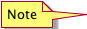
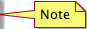
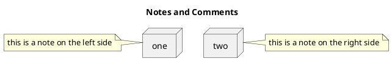
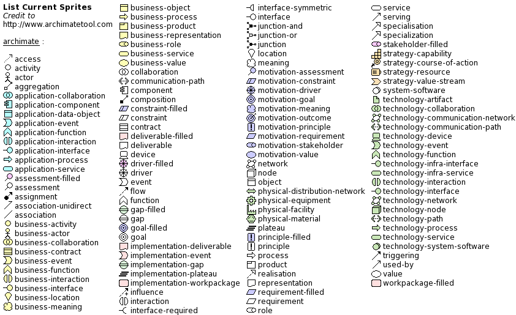
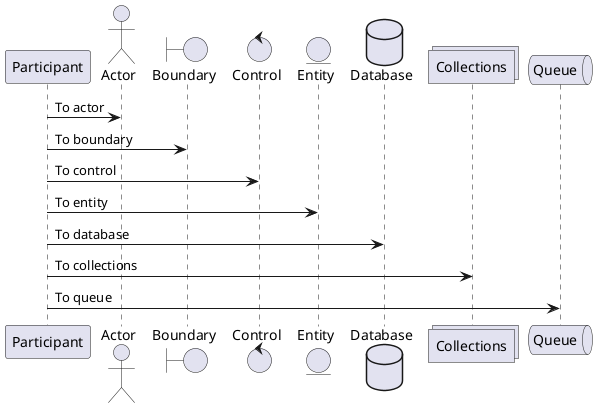

[PlantUML](http://plantuml.sourceforge.net/) is a component that allows to quickly write.
This is cheat sheet of PlantUML to use frequently.

Tempaltes/Examples:

[component-template.puml](Component/component-template.puml) - Shows component diagram/template.  Includes grouping, etc.


## Basic

## Examples

## Common

Notes and Comments.
[Title](images/title/png)

|   keyword    |       usage       |image                                        |
|:------------:|:-----------------:|:--------------------------------------------|
|   `title`    |       Title       |     |
|`note left :` |    Notes Left     | |
|`note right :`|    Notes Right    ||
|     `' `     |Single-line Comment|                                             |
|   `/' '/`    |   Block Comment   |                                             |


### Code



### Draw


## Archimate Sprites

Participants and Sequence Actors





## Arrow

Arrow direction.

| keyword    | usage   | image
|:----------:|:-------:|
| `-up->`    | Up      | 
| `-down->`  | Down    | 
| `-left->`  | Left    | 
| `-right->` | Right   | 

### Code

```
up -up-> right
-right-> down
-down-> left
-left-> up
```

### Draw


# UML

## Use Case

Represent the required functions.

|keyword|     usage     |image                                                             |
|:-----:|:-------------:|:-----------------------------------------------------------------|
| `( )` |   Use Case    | |
| `->`  |      Use      ||
| `.>`  |Extend, Include||


* [others](http://plantuml.sourceforge.net/usecase.html)

### Code

```
actor Promoter
actor Entrant

Promoter --> (Create Event)
Promoter -> (Attend Event)

Entrant --> (Find Event)
(Attend Event) <- Entrant

(Attend Event) <.. (Create Member)  : <<include>>
```

### Draw


## Activity

Represent the state of the process.

|keyword | usage  |image                                                                 |
|:------:|:------:|:---------------------------------------------------------------------|
| `" "`  |Activity|    |
|`(*) ->`|Initial ||
|`-> (*)`| Final  |  |
[]

* [others](http://plantuml.sourceforge.net/activity.html)

### Code

```
(*) --> "Find Event"
"Find Event" -> "Attend Event"

if "Capacity?" then
  ->[ok] "Create Ticket"
else
  -->[full] if "Standby?" then
    ->[ok] "Standby Ticket"
  else
    -->[no] "Cancel Ticket"
    "Cancel Ticket" --> (*)
  endif
endif

"Create Ticket" --> ==show==
"Standby Ticket" --> ==show==
==show== --> "Show Ticket"
"Show Ticket" --> (*)
```

### Draw


## State

Represent the state of the objects.

| keyword    | usage   | image
|:----------:|:-------:|
|  `[*] ->`  | Initial | 
|  `-> [*]`  | Final   | 

* [others](http://plantuml.sourceforge.net/state.html)

### Code

```
[*] --> active

active -right-> inactive : disable
inactive -left-> active  : enable

inactive --> closed  : close
active --> closed  : close

closed --> [*]
```

### Draw


## Sequence

Represent the messages and  orders of the interacts.

| keyword  | usage   | image
|:--------:|:-------:|
| `->`     | Message | 
| `<--`    | Return  | 

* [others](http://plantuml.sourceforge.net/sequence.html)

### Code

```
actor Entrant

Entrant -> Ticket : Attend Event Request

activate Ticket
Ticket -> Member : Create Member Request

activate Member
Member -> Member : Create Member
Ticket <-- Member : Create Member Response
deactivate Member

Ticket -> Ticket : Create Ticket
Entrant <-- Ticket : Attend Event Response
deactivate Ticket
```

### Draw


## Object

Represent the logical view of the object.

| keyword  | usage       | image
|:--------:|:-----------:|
| `object` | Object      | 
| `<|-`    | Extension   | 
| `*-`     | Composition | 
| `o-`     | Agregation  | 

* [others](http://plantuml.sourceforge.net/objects.html)

### Code

```
object User
object Group
object Member

object Event
object Ticket

User . Group
User o.. Member
Group o.. Member

Group o. Event
Event o.. Ticket
Member . Ticket
```

### Draw


## Class

Represent the logical view of the class.

| keyword | usage     | image
|:-------:|:---------:|
| `class` | Class     | 
| `+`     | Public    | 
| `-`     | Private   | 
| `#`     | Protected | 
| `~`     | Package   | 

* [others](http://plantuml.sourceforge.net/class.html)

### Code

```
class User {
  username
  password
  +sign_in()
}

class Group {
  name
}

class Member {
  roles
}

User .. Member
Group .. Member
```

### Draw


## Component

Represent the dependency of the components.

| keyword    | usage      | image
|:----------:|:----------:|
| `[ ]`      | Component  | 
| `package`  | Package    | 
| `frame`    | Frame      | 
| `folder`   | Folder     | 
| `database` | Database   | 
| `node`     | Node       | 
| `cloud`    | Cloud      | 

* [others](http://plantuml.sourceforge.net/component.html)

### Code

```
cloud "Cloud" {
  package "Package" {
    [register]
    frame "frame" {
      [backup]
    }
  }
}

node "Node" {
  database "Database" {
    [store]
  }
  folder "Folder" {
    [File]
  }
}

[register] .. [store] : HTTP
[backup] .. [File] : FTP
```

### Draw


## Colors
We can add colors to Arrows, Icons, Sprites, Components, Packages, etc.
PlantUML support Hexadecimal colors or colors that are already defined.

Site Reference: http://plantuml.com/skinparam

### Code

```
' =================
' == Declaration ==
' =================

[Component 1]

node "Node 1" {
    package "Package 1" #Orange {
        [Component 4]
        [Component 3]
    }
    [Component 2]
}


' ====================
' == Implementation ==
' ====================


node "Node 1" {
    [Component 2] .[#Green]-> [Component 4]
    [Component 3] <-left-> [Component 4]
    [Component 4] -- [Component 1]
}
```

### Draw


## Legends

Legend can contain only text, or some tables.
This example contain a table with some HTML inside and OpenIconic.

OpenIconic Reference: http://plantuml.com/openiconic

### Code

```
legend
    |= Color |= Type |= Description |
    | <size:11><back:#Crimson>           </back></size>|    <&arrow-right> | Example 1 |
    | <size:11><back:#LightSeaGreen>           </back></size>|    <&arrow-right> | Example 2 |
    | <size:11><back:#DarkGreen>           </back></size>|    <&arrow-right> | Example 3 |
    | <size:11><back:#YellowGreen>           </back></size>|    <&box> | Example 4 |
    | <size:11><back:#Chocolate>           </back></size>|    <&box> | Example 5 |
endlegend
```

### Draw


## Constants
It's possible to declare constants that will help us for example to include files or other *.puml

PS: when you use it remove ${}, thats only there for the example

### Code
```
!define ${VARIABLE NAME} ${VARIABLE VALUE}
```

## Sprites & Includes
There are a lot of useful sprites and images that we can use.
In the next example you have all the ways to implement components using this open source library.

### Code
```
!include <font-awesome/common>

!define ICONURL https://raw.githubusercontent.com/Roemer/plantuml-office/master/office2014
!includeurl ICONURL/Servers/application_server.puml

' =================
' == Declaration ==
' =================

OFF_APPLICATION_SERVER([Component 1], "Component 1", component, #Green)

node "Node 1" {
    package "Package 1" #Orange {
        OFF_APPLICATION_SERVER([Component 4], "Component 4")
        OFF_APPLICATION_SERVER(Component3, "Component 3", component)
    }
    OFF_APPLICATION_SERVER([Component 2])
}


' ====================
' == Implementation ==
' ====================


node "Node 1" {
    [Component 2] .[#Green]-> [Component 4]
    Component3 <-left-> [Component 4]
    [Component 4] -- [Component 1]
}
```

### Draw

SAVE TO CACHER